## ETL Introduction 
ETL stands for Extract, Transform, and Load. Main goal in this project is to migrate and convert Takecare data to openEHR.  

#### Extraction
Extract data in ETL compatible format​ and transfer to Transformation layer​.

#### Transformation
Uses openEHR template, binds clinical data and context metadata with template structure. ​Creates openEHR compositon ​and transfers the same to Loader Layer​.

#### Loader
Resolve/Create Patient EhrId from (FHIR/EHR), then maps EhrId to Composition ​and saves data to opeEHR.

As a part of this application ETL tool was developed for following information types:
- Care Documentation
- Measurement
- Medication
- Chemistry
- Activity

#### Project struture for ETL
All ETL project shares the same structure (each one has different logic for extraction and transformation), each of ETL consists of 2 projects:
- Extraction  
- Transformer as shown in below screenshot. 

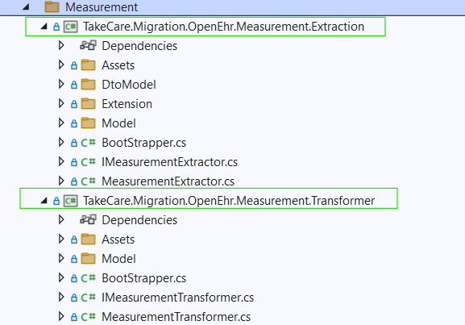

- And there respective EtlHandler in TakeCare.Migration.OpenEhr.Etl project

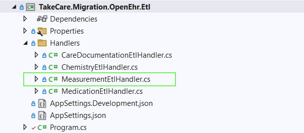

#### Notes :

-To add new iCKM archetype, add the Terminology details to the Terminolgy.json, then add the composition creation logic to iCKMArchetypes, and finally add to the switch logic in Composition to call the apt composition logic.

-**Extract layer read data from Test files and create etl compatible format, however if file has invalid Data e.g invalid date which can't be converted to ISO format, such data file will fail. So if any of record fails while extracting/transforming that actually fails whole file.**

## Services
List of common services used throughout the application based on their need.

#### Unit Provider

The Unit Provider Service takes the TakeCare unit as input as provides the corresponding standard OpenEHR unit.

#### Context Provider

The Context Provider Service takes the CareUnit and CareProvider details. It takes the Care Unit Id and returns the corresponsing Care Unit and Provider name.

#### Terminology Provider

The Terminology Provider Service takes the term Id as input and returns the corresponding details about the termID like Name, Datatype, and Unit.

#### Patient Service

The Patient Service provides the Patient Id based on the SSN (Social security number) ID provided in the data files.

#### Role Provider

The Role Provider service provides the Role details(Prefosseion details) with respect to the the given Role Id. 

#### Form Provider

The Form Provider service provides form API details like Name and latest version for a given template Id.

#### Medication Service

Calls substituable service which used to get code and values based on the value of Isreplaceble.

#### Notes :

To add new iCKM archetype, add the Terminology details to the Terminolgy.json, then add the composition creation logic to TakeCare.Foundation.OpenEhr.Archetype.Entry, and finally add to the switch logic in Composition to call the appropriate composition logic.

## Care Documentation

#### Overview 
Care Documentation ETL extracts the Case Notes from the given xml file, flattens the nested Keyword structure, and transforms the data into composition for loading into OpenEhr CDR.

#### Input
Xml

#### Template 
RSK - Journal Encounter

#### Extraction and Transformation
The Extraction project flattens the Nested Keyword structure.
Every keyword is assigned an Id and the parent keyword references its children by maintaining a list of the their Ids.

The Tranformation project creates a composition for each casenote and its metadata for the Patient with PatientId in each file. The unique structure of the nested keywords is maintained with the flattening in extraction and dynamically creating the AQL paths for the composition. 

#### Challenges 
The care documentation xml structure was complicated and dynamic due to TakeCare structur containing nesting of keywords and their values.

## Measurements

#### Overview
In Measurement ETL patient measurements data is in Json file. These files are processing json files through ETL.

File name conventions:
- Measurements_195207291591_20241023084031-197803070189.json
- 195207291591 - Stands for Patient Id
- 20241023084031 - Stands for Created datetime
- 197803070189 - Stands for Createdby user Id

#### Input 
Json

#### Template
RSK - Journal Encounter

#### Extraction and Transformation

Extraction project extracts the measurement details from json file and forms list of measurement, and transformer transforms these measurement to a single composition. So in case of measurment we create a composition per input file.

In each json file there are template field which contains list of terms. These templates are saved by creating separate json file with name - "template-{templateId}.json. For the POC these are stored in local file system.

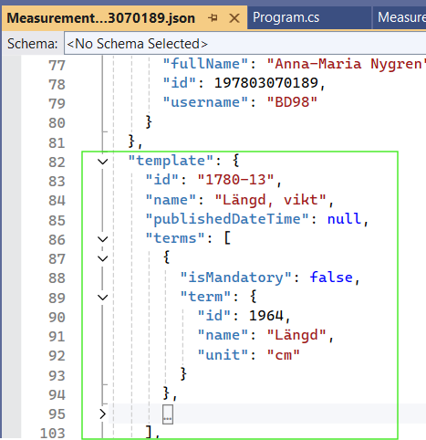

#### Challenges
NA

## Medication

#### Overview

In Medication ETL, the test data was provided in xml file and had collection of medication, prescription drug dosages and days details along with administration and infustion lists. 

#### Input
Xml

#### Template
RSK - Medication order

#### Extraction and Transformation

Extraction project extracts the xml input file to list of medication objects, and this list is provided as Input to transformer project

Transformer project gets the list of medications and transforms it to composition by using template mapping.

#### Challenges- 
- The xml input file has complex structure and have list of elements (Medication, Prescription, Drugs, Dosages, Days, Administration, Infusion). In the POC simple template and mapping were used to save Medication, Prescription, Drugs etc. The more complex templates are not used in POC in the visualization work. They will be needed if all medication data needs to be visaluized in the future.
- **Simple mapping is considering Single drug, if IsMixture value is 0 and drug count is 1 then Medication is saved, the rest will be skipped for POC. Multi-drug case will be covered in complex mapping (2nd phase).**
- In 2nd phase complex compostion will be saved - contains inter-relation between drug, dosages and days.
- Medication is saved in a composition and Administration and infusion are saved in separate compositions where they are linked them to their respective medication.

## Clinical Chemistry

#### Overview
Chemistry ETL extracts the Lab results from the given json file, and transforms the data into composition for saving into OpenEhr CDR.

#### Input
Json

#### Template
Lab_result_report_TCPOC

#### Extraction and Transformation
The Chemistry Extraction project reads data from the Json file into the class models for creating a list of Lab results. It also converts the dates into ISO format.

The Transformation projects creates a composition for each file as each file contains one lab result for the given patient. 

#### Challenges
NA

## Activities

#### Overview 
Activities ETL extracts the Activities from the given json file, and transforms the data into composition for loading into OpenEhr CDR.A

#### Input
Json

#### File naming convention
[title/name]_[patientId].json - To map the data of the file to the respective patient, the Patient Id is fetched from the name of the file.
eg. Activities_12345.json 

#### Template 
RS - Activity

#### Extraction and Transformation
The Extraction reads the Json file and maps to class models to form a List of Objects. For each activity, the dates are converted into ISO format and if the date and time are separate, then they are also merged into separate property with DateTime format for saving into the composition.

The Tranformation project creates a composition for each activity and its metadata. The composition is dynamically created for each activity. The frequency content which varies as per the frequency type (0, 1, 2, 3) is also mapped as per the template.

#### Challenges 
The frequency content in the input varies depending on the frequency type.

Following are the frequency types-

- 0 - the content property contains a FrequencySingle object
- 1 - the content property contains a FrequencyDaily object 
- 2 - the content property contains a FrequencyScheduleDay object 
- 3 - the content property contains a FrequencyScheduleWeek object 
- 4 - the content property contains a FrequencyContinuous object 
- 5 - the content property contains a FrequencyIrregular object 

Frequency 0, 1, 2, and 3 are covered in this project.

## Angular Application for visualization of Measurement and Clinical Chemistry data

The code needs cleaning up but that will be part of next step. This app is developed in very short time for demo.

## SUMMARY

| Module    | Template Name  |  View Used    |   Widget Used  |   Form     |   UI    |
| --------- | -------------- |----------------- |---------------- |------------ |--------------|
| Care Doc  | RSK - Journal Encounter   |    RSK.View.CaseNoteList, RSK.View.CaseNoteFilter, RSK.View.Keywords, RSK.View.CaseNote.Json     |    Used better column list, select list, buttons etc  |    RSK_Form_Journalview  |    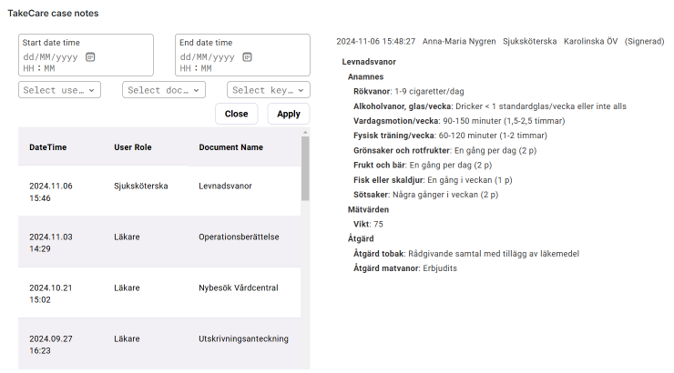     | 
| Measurement | RSK - Journal Encounter |   RSK.View.Measurements.Data, RSK.View.Measurements.MaxDate     |    Table for showing data over time    |     RSK.Form.Widget.Measurements  |  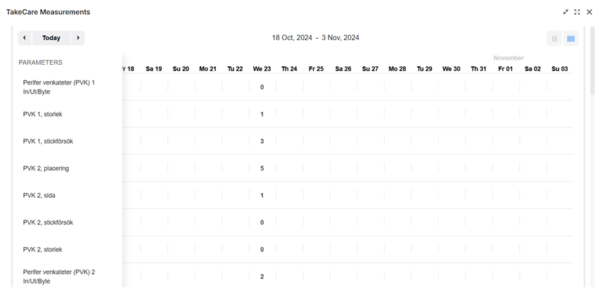    |
| Blood pressure and pulse Widget | RSK - Journal Encounter |   RSK.View.Widget.Line.Chart.Systolic.Diastolic.Pulse    |    Blood pressure and pulse Widget    |     RSK.Form.Widget.Line.Chart.Systolic.Diastolic.Pulse  |  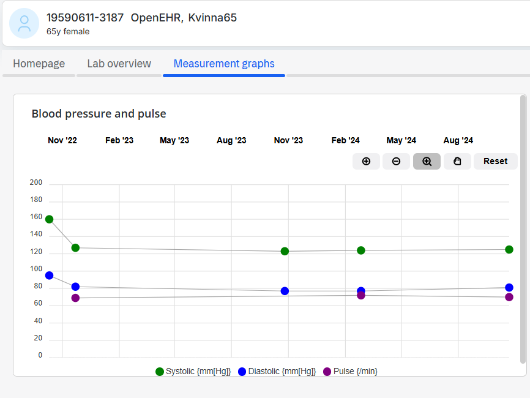    |
| Height Weight BMI Widget | RSK - Journal Encounter |   RSK.View.Widget.Weight_Height_BMI    |    Parameter with History   |     RSK.Form.Widget.Height_Weight_BMI  |   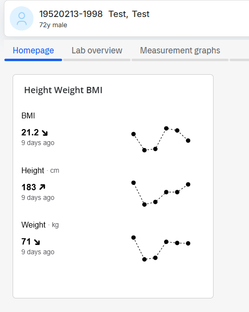   |
| Weight(kg) | RSK - Journal Encounter |   RSK.View.Widget.Line.Chart.Weight     |    Simple Line Chart    |     RSK.Form.Widget.Line.Chart.Weight  |    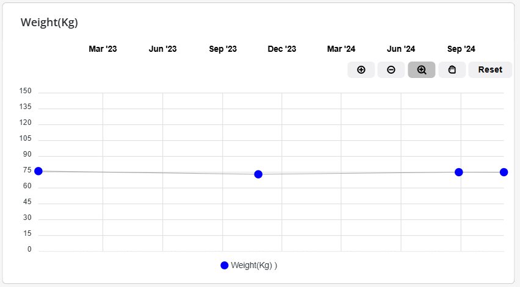    |
| Medication  | RSK - Medication order  |   RSK.View.Medication     |    Column List     |     RSK.Form.Widget.Medication   |  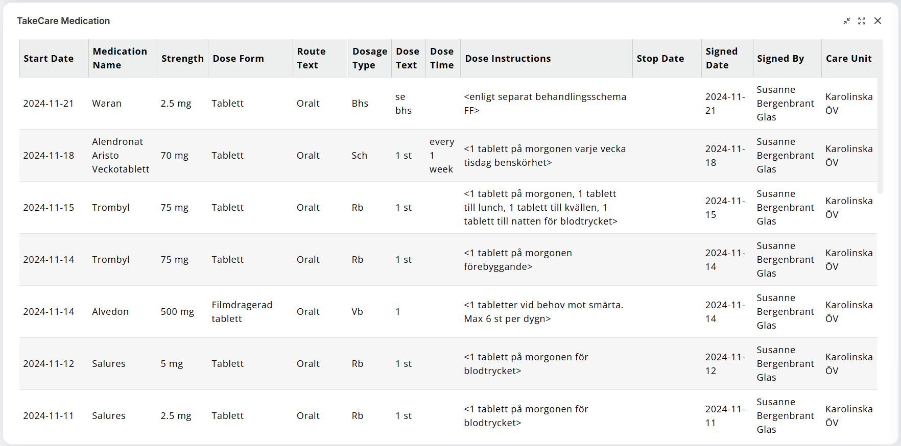       |
| Chemistry   | Lab_result_report_TCPOC |   RSK.View.Chemistry.Data, RSK.View.Chemistry.MaxDate     |    Table for showing data over time     |    RSK.Form.Widget.Chemistry   | 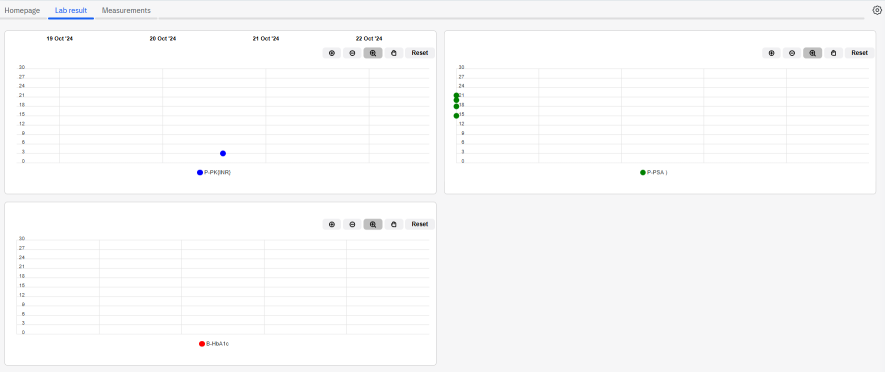      | 
| B-HbA1c(mmol/mol)  | Lab_result_report_TCPOC      |   RSK.View.Widget.Line.Chart.B-HbA1c   |    Simple Line Chart    |    RSK.Form.Widget.Line.Chart.B-HbA1c   |   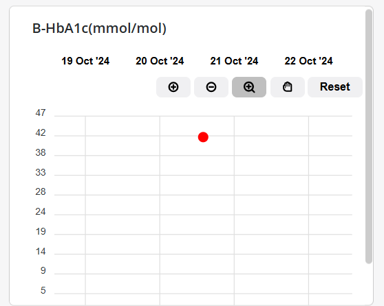   |
| P-PK(INR) widget   | Lab_result_report_TCPOC |   RSK.View.Widget.Line.Chart.P-PK(INR)  |    Used better simple line chart widget  |    RSK.Form.Widget.Line.Chart.P-PK(INR)  |   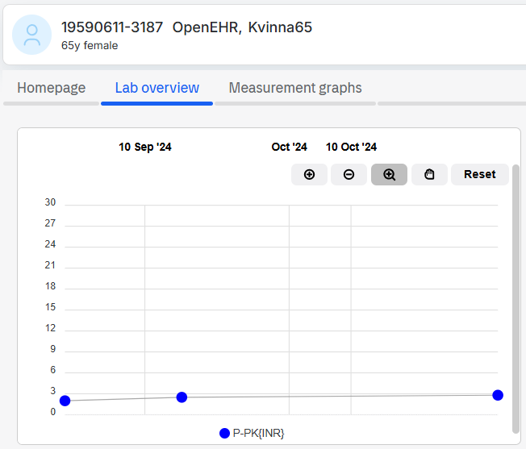     | 
| P-PSA   | Lab_result_report_TCPOC |   RSK.View.Widget.Line.Chart.P-PSA     |  Simple Line Chart  |  RSK.Form.Widget.Line.Chart.P-PSA   |  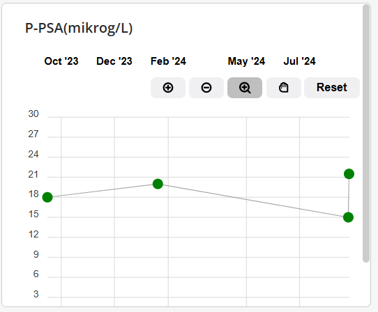   | 
| Activities  | RS - Activity           |   RSK.View.ActivityList     |    Used better column list, select list, buttons etc.     |    RSK_Form_Widget_Activities   |    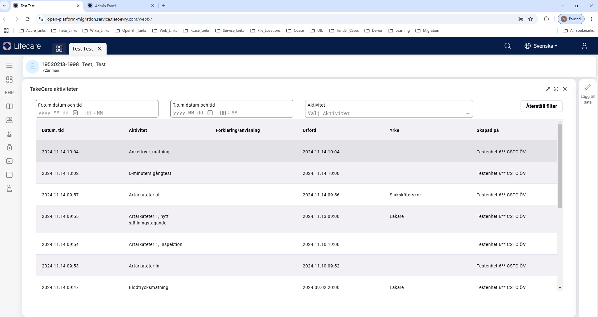       |
------------------------------------------------------------------------------------------------------------------------------------------

## Solution Structure

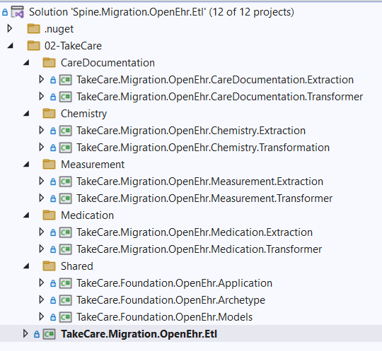

- CareDocumentation >
    - **TakeCare.Migration.OpenEhr.CareDocumentation.Extraction**- Care documentation extraction
    - **TakeCare.Migration.OpenEhr.CareDocumentation.Transformer** - Care documentation transformation

- Chemistry >
    - **TakeCare.Migration.OpenEhr.Chemistry.Extraction** - Chemistry extraction
    - **TakeCare.Migration.OpenEhr.Chemistry.Transformation** - chemistry transformation

- Measurement >
    - **TakeCare.Migration.OpenEhr.Measurement.Extraction** - measurement extraction
    - **TakeCare.Migration.OpenEhr.Measurement.Transformer** - measurement transformation

- Medication >
    - **TakeCare.Migration.OpenEhr.Medication.Extraction** - medication extraction
    - **TakeCare.Migration.OpenEhr.Medication.Transformer** - medication trasformation

- Shared >
    - **TakeCare.Foundation.OpenEhr.Application** - has common functionalities like services and models
    - **TakeCare.Foundation.OpenEhr.Archetype** - has common ickm archetype models 
    - **TakeCare.Foundation.OpenEhr.Models** - has common models other than ickm archetypes

- **TakeCare.Migration.OpenEhr.Etl** >
    - Main project where we add etl handler for each modules and set this as a startup project. All etls can be run in one go or one at a time.

## How to Setup and Run

Startup project

TakeCare.Migration.OpenEhr.Etl
Program.cs

Set **TakeCare.Migration.OpenEhr.Etl** project as startup project

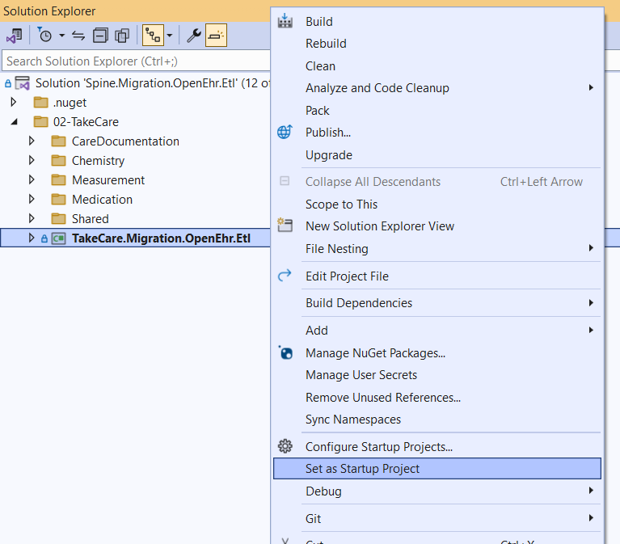
