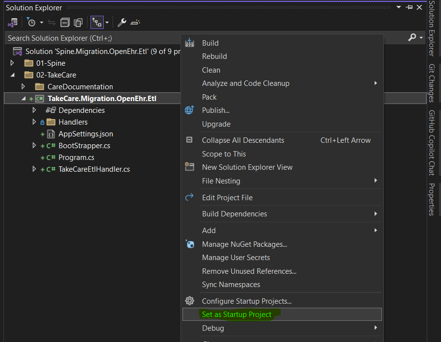

## Spine.Migration.OpenEhr.Etl Main Solution

Startup project

TakeCare.Migration.OpenEhr.Etl
Program.cs

Set **TakeCare.Migration.OpenEhr.Etl** project as startup project

## Care Documentation

#### Unit Provider

The Unit Provider provides the standard Open EHR units of the Take Care units.

#### Context Provider

Provides User context data

#### Terminology Provider

Maps the TermID from the Casenote document to the OpenEHR standard TermID and gives the details.

#### Patient Service

Provides the Patient Id based on the SSN ID porvided in the Care Documentation.

#### EHR ID resolver

Provides the EHR ID based of the Patient Id fetched earlier.

#### Terminology Lookup Provider

Reads the TermCatalog and provide information about the TermID, its names, datatype and unit

#### Role Provider

Provides lists of the role Id (profession ID) and the respctive roleName(profession Name).

#### Form Provider

Provides form API details like Name and latest version.

#### Notes :

To add new iCKM archetype, add the Terminology details to the Terminolgy.json, then add the composition creation logic to iCKMArchetypes, and finally add to the switch logic in Composition to call the apt composition logic.

## Measurements
